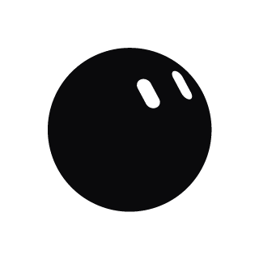

# bloub widget

[](https://creativecommons.org/licenses/by-nc-sa/4.0/)  

An animated SVG widget that breathes, blinks and watches the cursor; embed it with a single script tag.

**English** | [简体中文](README.zh-CN.md)

---



## Overview

bloub widget is a framework-free, zero-dependency widget built on the engine of [bloub](https://github.com/jeremy-prt/bloub) by Jérémy Perret. The character is a single filled shape that morphs between expressions; its eyes are holes cut into the shape and they follow the pointer. Click it to cycle through your own sequence of moods.

Configure one visually on the customizer page, then paste the generated snippet into any page — no build step, no dependencies.

Customizer: <https://bloub.wangnan.net/>

## Features

- Pure SVG rendered with vanilla DOM; no framework and no runtime dependencies
- Eyes follow the pointer; clicking cycles a customizable mood sequence with a spring "pop"
- 16 expressions, 8 shapes, 12 colours; every mood keeps its own shape and colour
- Two embed modes: inside a container of your chosen size, or a fixed disc in a viewport corner
- Double-click any embedded widget to reopen the customizer with that exact configuration
- Animation pauses while the widget is off-screen; about 32 KB minified

## Customize

1. Click an expression on the right, and drag it into the click cycle.
2. Drag cards sideways to reorder; drag an expression onto a card to replace that card's expression.
3. Select a card, then pick a shape and a colour for that card alone. New cards start as a black circle.
4. Copy either the container-mode or the global-mode snippet.

## Usage

### Container mode

Prepare a positioned `<div>` with a width and a height, then paste the snippet inside it:

```html
<div data-bloub='{"moods":[{"expression":"neutre","color":"encre","shape":"cercle"},{"expression":"heureux","color":"encre","shape":"cercle"}]}' style="width:100%;height:100%"></div>
<script src="https://bloub.wangnan.net/bloub.js"></script>
```

The script initializes every element carrying a `data-bloub` attribute automatically.

### Global mode

Paste the snippet into `<body>`; a white round badge is created in the chosen viewport corner:

```html
<script src="https://bloub.wangnan.net/bloub.js"></script>
<script>
  Bloub.fixed({ corner: "br", size: 64, margin: 16 }, {
    moods: [
      { expression: "neutre", color: "encre", shape: "cercle" },
      { expression: "heureux", color: "encre", shape: "cercle" }
    ]
  });
</script>
```

### JavaScript API

- `Bloub.mount(target, config?)` — render inside `target` (an element or a selector). The target controls the size.
- `Bloub.fixed(fixedOptions?, config?)` — create a fixed badge disc and append it to the body.
- Both return an instance with `setMoods(moods, startIndex?)`, `getMoods()` and `destroy()`.

### Configuration reference

`config` fields:

| Field | Default | Description |
|---|---|---|
| `moods` | one neutral mood | Array of `{ expression, color?, shape? }`; the first item is shown on load |
| `follow` | `true` | Eyes follow the pointer |
| `pop` | `true` | Play the scale pop on click |
| `clickable` | `true` | Clicking cycles the mood; set `false` for a purely decorative widget |
| `onMoodChange` | — | Called after a click advances to another mood, with the new index |
| `paper` | `#ffffff` | Colour seen through the eye holes |
| `toolUrl` | customizer url | Page opened on double click |

`fixedOptions` fields:

| Field | Default | Description |
|---|---|---|
| `corner` | `br` | Viewport corner: `br`, `bl`, `tr`, `tl` |
| `size` | `64` | Disc size in pixels |
| `margin` | `16` | Distance from the viewport edge in pixels |

Catalog ids:

- Expressions: `neutre`, `attentif`, `surpris`, `excite`, `heureux`, `hilare`, `colere`, `triste`, `effraye`, `mefiant`, `confus`, `curieux`, `fier`, `timide`, `blase`, `somnolent`
- Shapes: `cercle`, `galet`, `squircle`, `capsule`, `triangle`, `hexagone`, `nuage`, `goutte`
- Colours: `encre`, `brun`, `rouge`, `orange`, `ambre`, `vert`, `turquoise`, `bleu`, `violet`, `rose`, `gris`, `creme`

## Self-hosting

The engine is a single static file. You may serve `bloub.js` yourself or reference a tagged release through a CDN, for example:

```
https://cdn.jsdelivr.net/gh/theFool-wn/bloub-widget@v1.0.0/bloub.js
```

## Building from source

```
npm install
npm run build   # bundles bloub.js and assets/tool.js
npm run gif     # regenerates docs/calm.gif
```

## Version

**Created:** Wang Nan, 2026.10.06

**Contact:**

* [me@wangnan.net](mailto:me@wangnan.net)

**Upstream:**

* [bloub](https://github.com/jeremy-prt/bloub) — Jérémy Perret, MIT License (see `licenses/bloub-MIT-LICENSE`)

## License

This work — the widget wrapper, the customizer page and the documentation — is licensed under the **[CC BY-NC-SA 4.0 License](https://creativecommons.org/licenses/by-nc-sa/4.0/)**.

You are free to use, share, and adapt this work for **non-commercial purposes**, provided that:

* You must give **appropriate credit**, provide **a link to this License**, and indicate if modifications were made. You may give credit in any reasonable way, but you must not do so in any way that suggests that the licensor endorses you or your use.
* You **distribute any modifications under the same license**.

The animation engine under `src/bot/` is derived from bloub by Jérémy Perret and remains under the **MIT License**; the copyright and permission notices are preserved in `licenses/bloub-MIT-LICENSE`.

© 2026 Wang Nan. All rights reserved.
